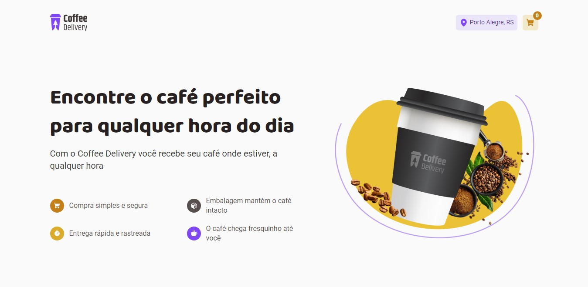

<a name="readme-top"></a>

<!-- PROJECT LOGO -->
<br />
<div align="center">

  <a href="https://github.com/DarkMetaK/coffee-delivery">
    
  </a>

  <h3 align="center">Coffee Delivery</h3>

  <p align="center">
    Desafio Ignite React: E-commerce simples de café
  </p>
</div>


<!-- TABLE OF CONTENTS -->
<details>
  <summary>Sumário</summary>
  <ol>
    <li>
      <a href="#sobre">Sobre</a>
      <ul>
        <li><a href="#tecnologias">Tecnologias</a></li>
      </ul>
    </li>
    <li>
      <a href="#como-rodar-o-projeto">Como rodar o projeto</a>
    </li>
    <li><a href="#contato">Contato</a></li>
    <li><a href="#agradecimentos">Agradecimentos</a></li>
  </ol>
</details>


<!-- ABOUT THE PROJECT -->
## Sobre

<a href="https://coffee-deliverys.netlify.app/">
    
</a>

O site se trata de um e-commerce simples focado em entregar diferentes tipos de café, possuindo um sistema completo de carrinho desenvolvido para reforçar conceitos como contexts, localstorage e reducers. Para estilização foi utilizado Tailwindcss, visando obter uma interface responsiva e fiel ao design.

### Tecnologias

[![React][React.js]][React-url]<br>
[![TypeScript][TypeScript.js]][TypeScript-url]<br>

<p align="right">(<a href="#readme-top">Retornar ao topo</a>)</p>

<!-- GETTING STARTED -->
## Como rodar o projeto

[Você pode acessar o deploy clicando aqui!](https://coffee-deliverys.netlify.app/)

1 - Clone o repositório
```sh
git clone https://github.com/DarkMetaK/coffee-delivery.git
```

2 - Instale as dependências
```sh
pnpm install
```

3 - Execute o projeto
```sh
pnpm run dev
```

<p align="right">(<a href="#readme-top">Retornar ao topo</a>)</p>

<!-- CONTACT -->
## Contato

Matheus Porto - [LinkedIn](https://www.linkedin.com/in/matheusport0/) - matporto03@gmail.com

Link Repositório: [https://github.com/DarkMetaK/coffee-delivery](https://github.com/DarkMetaK/coffee-delivery)

<p align="right">(<a href="#readme-top">Retornar ao topo</a>)</p>

<!-- ACKNOWLEDGMENTS -->
## Agradecimentos

* [Best-README-Template](https://github.com/othneildrew/Best-README-Template)
* [Img Shields](https://shields.io)
* [Tailwindcss](https://tailwindcss.com/)
* [React Hook Form](https://react-hook-form.com/)
* [React Router](https://reactrouter.com/en/main)

<p align="right">(<a href="#readme-top">Retornar ao topo</a>)</p>

<!-- MARKDOWN LINKS & IMAGES -->
[React.js]: https://img.shields.io/badge/React-20232A?style=for-the-badge&logo=react&logoColor=61DAFB
[React-url]: https://reactjs.org/
[TypeScript.js]: https://shields.io/badge/TypeScript-3178C6?logo=TypeScript&logoColor=FFF&style=for-the-badge
[TypeScript-url]: https://www.typescriptlang.org/
